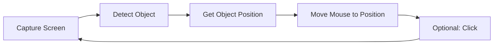

# Real-Time Object Tracker - Simplified Project Structure

## 🎯 Project Purpose
**Detect objects on screen in real-time and move mouse to their location**

---

## 📁 Streamlined Directory Structure

```
Object Detective/
├── 📄 main.py              # Main application entry point with CLI
├── 📄 requirements.txt     # Python dependencies (OpenCV, NumPy, PyAutoGUI, Pillow)
├── 📄 config.json         # Configuration file with tracking settings
├── 📄 README.md           # Comprehensive project documentation
├── 📁 src/                # Core source code (5 modules)
│   ├── 📄 __init__.py
│   ├── 📄 object_detector.py    # Template matching & color detection
│   ├── 📄 screen_capture.py     # Real-time screen capturing
│   ├── 📄 mouse_controller.py   # Smooth mouse movement & clicking
│   └── 📄 tracker_system.py     # Main coordination system
├── 📁 templates/          # Template images folder
│   └── 📄 README.md       # Template creation guide
├── 📁 examples/           # Ready-to-use example scripts
│   ├── 📄 README.md           # Examples documentation
│   ├── 📄 simple_tracker.py   # Basic object tracking
│   ├── 📄 gaming_bot.py       # Gaming automation with auto-click
│   ├── 📄 ui_automation.py    # UI testing & automation sequences
│   └── 📄 color_tracker.py    # Color-based tracking (10+ presets)
└── 📁 utils/             # Helper utilities
    ├── 📄 __init__.py
    ├── 📄 logger.py        # Advanced logging with performance tracking
    └── 📄 config_loader.py # JSON configuration management
```
---

## 🔧 Core Components (Only 5 Files!)

### 1. `src/object_detector.py`
**Purpose**: Find objects on screen using template matching or color detection
```python
# Key functions:
- detect_object(screen_image, template)
- find_by_color(screen_image, color_range)
- get_object_center(detection_result)
```

### 2. `src/screen_capture.py`
**Purpose**: Capture screen in real-time
```python
# Key functions:
- capture_screen()
- capture_region(x, y, width, height)
- get_screen_size()
```

### 3. `src/mouse_controller.py`
**Purpose**: Move mouse to detected object locations
```python
# Key functions:
- move_to(x, y)
- smooth_move_to(x, y, duration)
- click_at(x, y)
```

### 4. `src/tracker_system.py`
**Purpose**: Coordinate detection and mouse movement
```python
# Key functions:
- start_tracking(template_path)
- track_color_object(color_range)
- set_tracking_speed(fps)
```

### 5. `main.py`
**Purpose**: Simple interface to start tracking
```python
# Usage:
python main.py --template "templates/target.png"
python main.py --color-detect --red-range
```

---

## ⚙️ Simple Configuration (`config.json`)

```json
{
  "tracking": {
    "fps": 30,
    "confidence_threshold": 0.8,
    "smooth_movement": true,
    "movement_speed": 0.3
  },
  "detection": {
    "method": "template",
    "template_path": "templates/target_object.png"
  },
  "mouse": {
    "auto_click": false,
    "click_delay": 0.1
  }
}
```

---

## 📦 Minimal Dependencies (`requirements.txt`)

```txt
opencv-python==4.8.1.78
numpy==1.24.3
pyautogui==0.9.54
pillow==10.0.1
```

**Total**: Only 4 core packages!

---

## 🚀 Quick Start Examples

### Example 1: Basic Object Tracking
```python
# examples/simple_tracker.py
from src.tracker_system import TrackerSystem

tracker = TrackerSystem()
tracker.load_template("templates/target_object.png")
tracker.start_tracking()  # Mouse follows the object!
```

### Example 2: Color-Based Tracking
```python
# Track red objects on screen
tracker = TrackerSystem()
tracker.track_by_color(
    lower_red=(0, 100, 100),
    upper_red=(10, 255, 255)
)
tracker.start_tracking()
```

### Example 3: Gaming Bot
```python
# examples/gaming_bot.py
tracker = TrackerSystem()
tracker.load_template("templates/enemy.png")
tracker.enable_auto_click()  # Click when found
tracker.start_tracking()
```

---

## 🎮 Usage Scenarios

### 1. **Gaming Automation**
- Track enemies/targets in games
- Auto-aim assistance
- Resource collection bots

### 2. **UI Testing**
- Automated clicking on UI elements
- Form filling automation
- App testing scripts

### 3. **Accessibility Tools**
- Eye-tracking alternatives
- Voice-controlled mouse movement
- Assistive technology

---

## 🔄 Workflow Process



1. **Capture** screen continuously
2. **Detect** target object using template/color
3. **Calculate** object center position
4. **Move** mouse smoothly to position
5. **Repeat** at specified FPS

---

## 📝 Implementation Priority

### Phase 1: Core Functionality
1. ✅ Screen capture
2. ✅ Template matching detection
3. ✅ Mouse movement
4. ✅ Basic tracking loop

### Phase 2: Enhancements
1. 🔄 Smooth mouse mov